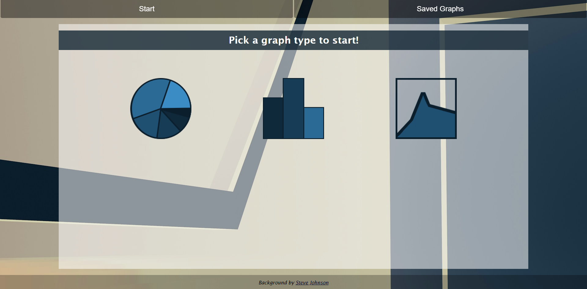
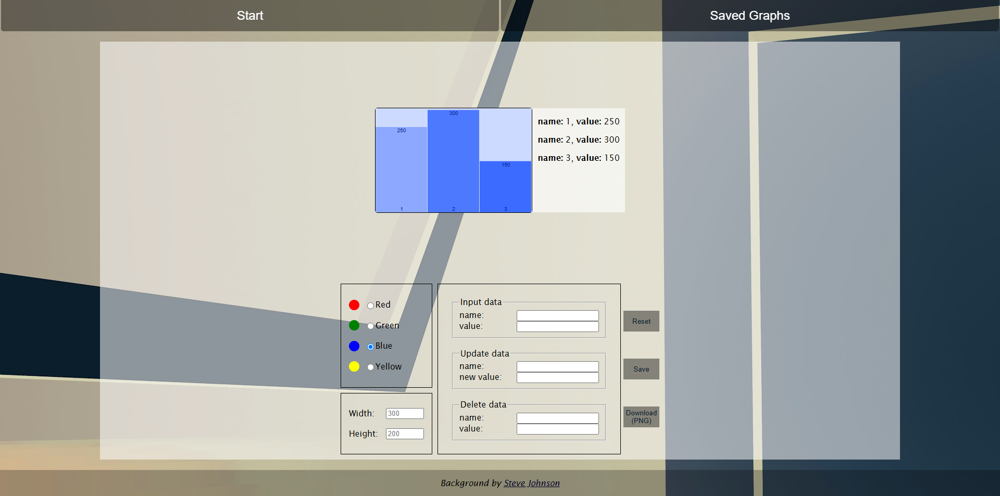
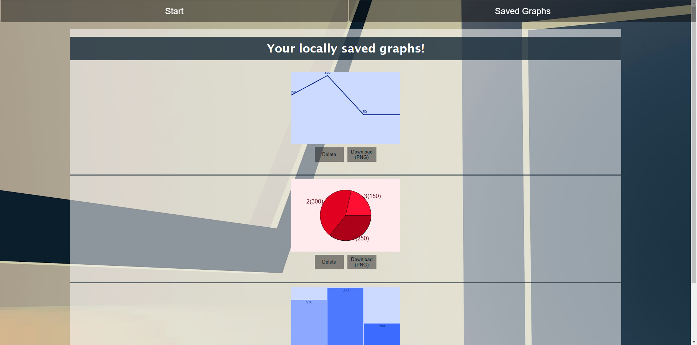
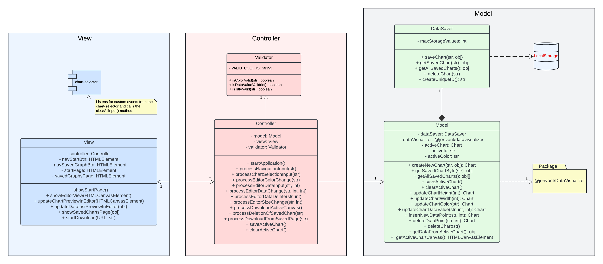

# 1DV610_WebApp_L3
A web-application where a user can create graphs/charts and either save them locally on the browser/in the application or download them as PNG files.

The application works as s SPA (Single Page Application) so the url never updates, everything is handled through javascript and DOM manipulation.

It is object oriented to the degree that JavaScript permits, the only static functions are the ones inte `index.js` file to start the application and open the start view.

## Applications entry point.
This is how the applications entry point looks like, a user can either choose a chart/graph type to open the editor or view saved graphs in the navigation bar.

## Editor
The view after a graph/chart type is chosen it opens the editor view, where the user can create and customize their chart.

## Saved graphs/charts
When a user clicks the "Saved Graph" in the navigation the view that shows all the previously saved graphs/charts is shown.

## Class diagram
This is a class diagram to show all the relations between the classes, external packages and storage.

