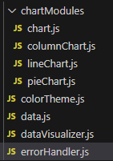
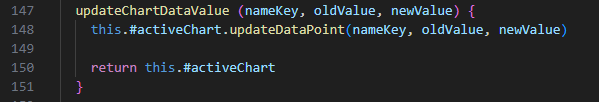
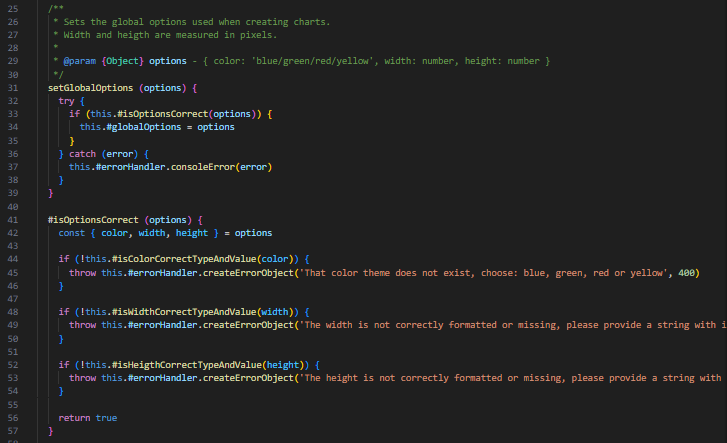
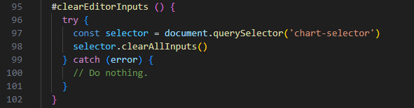
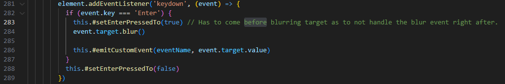
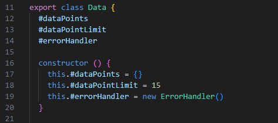

# Reflection L3
These are reflections based around the book Clean Code by Robert C. Martin and the chapters 2-11 on the code for the assignments [L2](https://github.com/JenniferVonT/DataVisualizer) (module) and L3 (this project).

## Chapter 2

**L2** - I think I followed this chapter well in L2 and tried to keep the names as meaningful and descriptive as possible and to avoid leaving false clues when it came to the naming of both classes and variables, they are all pronounceable. All my class names are nouns and say what they mean while my method names are verbs. The only class name I believe is the most "deceptive" is the DataVisualizer, it doesn't technically "visualize" the data, it creates the chart class that in turn visualize it. But I wanted that name for my module as a whole and thus decided to keep the "main" entry point class as the same name as the module at large.

(root directory)

**L3** - This assignment was where I ran in to some trouble trying to follow the second chapter. I decided to follow the MVC (Model View Controller) pattern for this project which made me have a really hard time with the naming of specifically method names and trying not to leave "false clues" by choosing very similar names that can sometimes be hard to differentiate between eachother. Since a lot of my methods do similar stuff but for different inputs and areas of the application I ran into these examples in my controller class for instance:

(./src/controller/controller.js)

I have a really hard time with naming when I'm faced with methods that does similar things but not similar enough to be refactored into one method (since that would also break against the rule that functions should be small)

## Chapter 3

**L2** - I think its hard to make the decision when a function truly only does "one thing", I tried as best as possible to follow this in L2 and refactor as much as possible when possible. It was easier in this project than L3 because the module had "one" goal and that was to create a chart that could be customized. It made it easier to make everything modular and keep the methods short. The one place where I think I failed with this was in the child classes to the Chart class, I tried refactor their methods but always ran into issues with the inheritance making it loose the progress in the process or running into issues with the reach between the parent/child classes and their methods so I decided to keep them long. But every other class in the project have short and concise methods where I interpret the majority to only do "one thing".

(./src/chartModules/pieChart.js)

**L3** - I tried to keep the methods small and arguments short, I managed to keep most methods dyadic or less (whereas the vast majority is nullary, with no arguments) to keep it simple, even in scenarios where I needed a lot of information I made the argument into one object with the data instead of several argument inputs. I have some exceptions to this though where I had to make a triadic method, they are very few and these are only the methods that handle changes to existing data where the original data is needed as a reference

(./src/controller/controller.js)

(./src/model/model.js)

## Chapter 4

**L2** - I decided to keep the comments minimal, leaning more on naming and the code structure to communicate what it does instead, with that said I still decided to implement jsdoc to all of my public methods ateast stating what the argument types should be. I wanted it to also be a help when using the module in an IDE that helps the user by showing the jsdoc when writing the code, making it more user friendly.

(./src/dataVisualizer.js)

**L3** - Since this project isn't geared towards other developers like the L2 module is I decided to omit comments on even the public methods since they aren't really "public" in the same sense as the L2. I believe the method names are descriptive enough, even if some arguments names could be helped by a comment to just clarify the data type. I have written module comments and very few explanatory comments where I think is neccessary. The first examples just clarifies that the catch block isn't left empty for nothing or forgotten, it is there because the element "chart-selector" is not always present in the DOM and gets an error when it can't find it otherwise. The second example is to clarify that the commented line has to come before the rest because the component handles both the blur/unfocus and keywdown event the same and it fires the event twice otherwise since it blurs it after the keywdown event.

(./src/view/view.js)

(./src/view/chart-selector.js)

## Chapter 5
**L2** - I have stuck to the same code format throughout the project, I didn't use any automated tool for this though which means there is a risk that the format I've choosen can have places where they differ, but I have not yet found anywhere noticeable in my code that strays from the set standard. All my global variables in the classes are all declared unaligned at the top of each class and without comment so they aren't to spaced out for an easier overview of the start of the class.

(./src/data.js)

**L3** - What I said for L2 can be applied for L3 aswell, but in this project I have implemented an automatic formatting tool (the npm `standard` package) to help with formatting, this has made it easier to really make sure that the entire code base follows the exact same formatting style everywhere.
A hard thing for me is deciding where to place methods based on conceptual affinity and a logical vertical ordering, if there is just a few methods this isn't an issue, but when several methods starts to use one method I have a hard time figuring out where to put the one method being used by many

## Chapter 6
**L2** -
**L3** -

## Chapter 7
**L2** -
**L3** -

## Chapter 8
**L2** -
**L3** -

## Chapter 9
**L2** -
**L3** -

## Chapter 10
**L2** -
**L3** -

## Chapter 11
**L2** -
**L3** -
